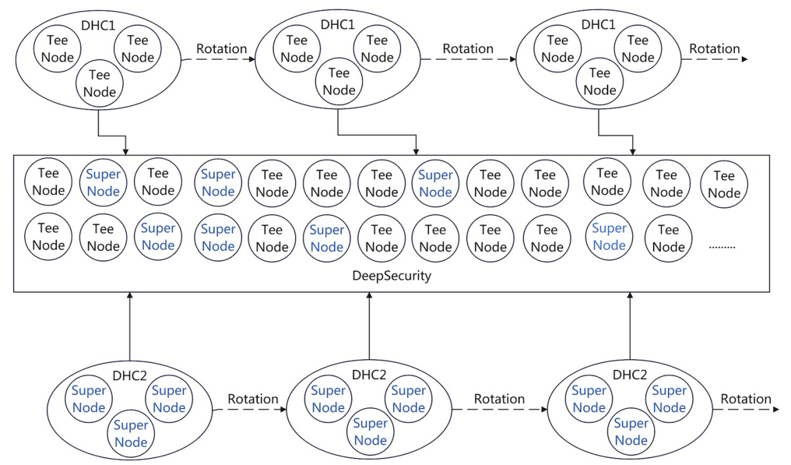
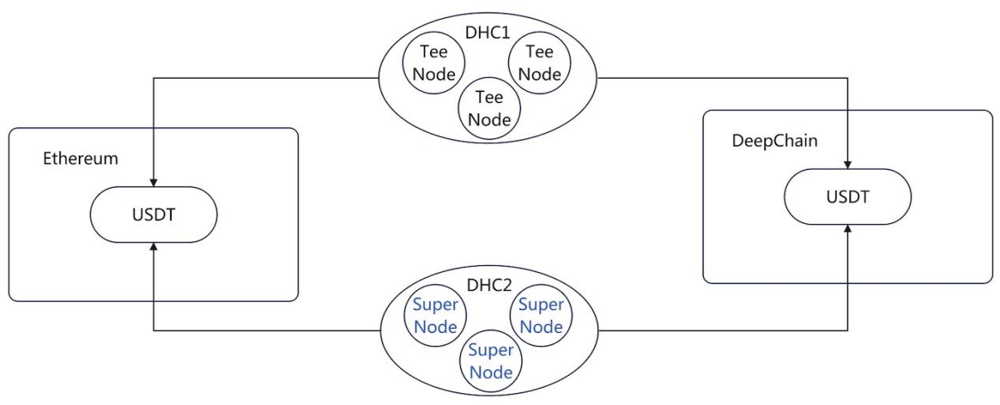
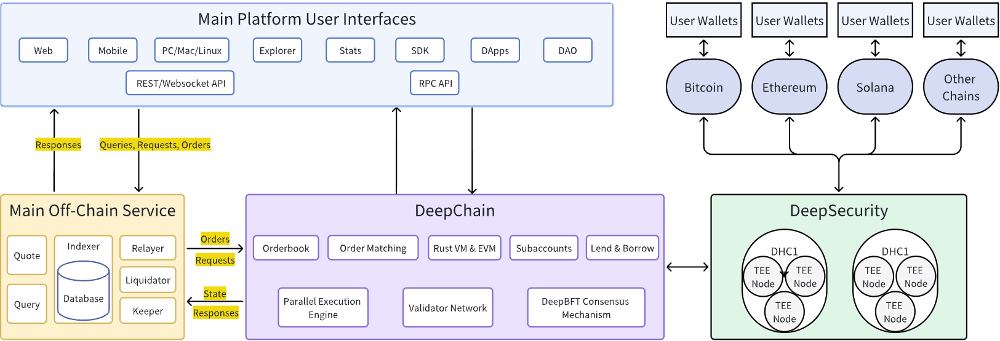
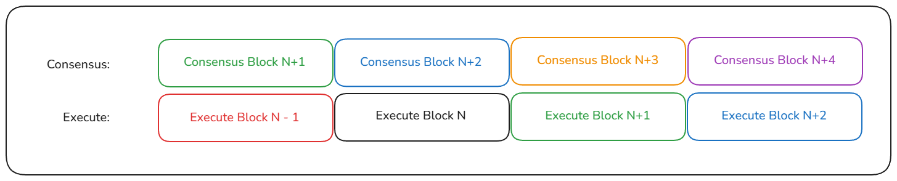
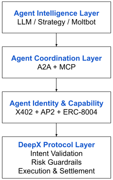
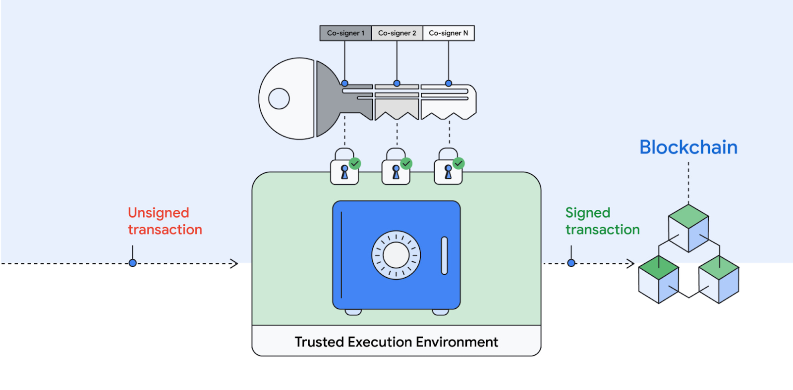

# DeepX: The AI-Native Unified Exchange

**Verified Security, Unified Intelligence.**

## Introduction: The Technical Turning Point for the Next-Generation Exchange

The evolution of crypto exchanges is undergoing a leap from performance optimization to architectural re-engineering. Centralized exchanges (CEX) gained performance and liquidity at the expense of asset sovereignty and verifiability; First-generation decentralized exchanges (DEX) adhered to self-custody and trustlessness but were long limited by underlying performance; Second-generation DEXs, centered on AMMs, made on-chain trading scalable for the first time but had inherent limits in capital efficiency and support for complex trades; Current third-generation DEXs reintroduce order books and high-performance matching systems, significantly improving trading performance bottlenecks, yet still making compromises in decentralization and asset security boundaries. Simultaneously, the current trading paradigm is shifting from a single matching act toward multi-strategy collaboration and AI-nativity. This means an exchange is no longer just a matching tool, but must be an infrastructure that supports complex financial logic.

It is against this backdrop that DeepX is proposed as The AI-Native Unified Exchange. It is not a linear improvement over CEX or DEX, but a systemic restructuring of the next-generation exchange's foundational form, built around four core technical pillars:

1.  Decentralized asset management and verifiable security model;

2.  A decentralized, high-performance, low-latency trading chain;

3.  The full on-chain, native-level implementation of the order book;

4.  The AI-Native account system: Agent, Intent, and automated trading.

These four aspects are not independent but are unified by DeepX within the same chain, the same state space, and the same risk engine. Through the decentralization of asset management, the decentralization of trading, and the decentralization of governance, DeepX creates a fully trustless trading environment across the entire process.

## I. Decentralized Asset Management: From Custodial Trust to Verifiable Security

### 1.1 The Asset Security Predicament of Traditional Exchanges

Whether CEXs or the majority of quasi-decentralized exchanges, their asset security models fundamentally rely on the following:

- Private key control by a single or a few operating entities;

- Non-transparent internal ledgers;

- Post-event auditing rather than pre-event verifiable security mechanisms.

The core characteristics of the CEX model are also reflected in its high functional integration and operating mechanisms. They typically simultaneously play the following roles:

**Custodian**: Directly controls users' assets.

**Broker**: Directly provides trading interfaces and order placement tools to users.

**Settlement Center**: Trades are completed instantly on internal ledgers.

**Market Maker/Proprietary Trading**: Some exchanges have their own proprietary trading departments, creating conflicts of interest with users.

History has repeatedly proven that this model is extremely vulnerable to systemic risks. DeepX's design goal is not to reduce the cost of trust, but to eliminate reliance on the operator's credibility through decentralized asset management, decentralized on-chain settlement, and decentralized governance.

### 1.2 Decentralized Asset Management

DeepX achieves a fundamental shift in asset management by introducing the decentralized multi-layer signature network, DeepSecurity.

#### 1.2.1 Decentralized Multi-Layer Signature Network (DeepSecurity)

The DeepSecurity architecture employs a Dynamic Hidden Committee (DHC) mechanism. It utilizes cutting-edge cryptography and hardware technologies such as Ring Verifiable Random Function (Ring VRF), Zero-Knowledge Proofs (ZKP), Multi-Party Computation (MPC), and Trusted Execution Environment (TEE) to build a decentralized non-custodial system.

In DeepX, the deposit and withdrawal of cross-chain assets no longer rely on a single centralized custodian, but are jointly verified and executed by committee members chosen through a cryptographic lottery. Its core responsibilities and technical implementations are as follows:

- **Security Assurance (Anti-Collusion and Attack)**: Unlike traditional fixed committees, DeepSecurity adopts a rotation mechanism. Committee members change at the end of each Epoch and securely hand over key shares. This dynamism vastly increases the difficulty for attackers to compromise the system, ensuring the long-term security of asset management.

- **Privacy Protection (Identity Concealment)**: To prevent nodes from being subjected to DoS attacks or external coercion, the protocol introduces Ring Verifiable Random Function technology. When a node proves it has the right to sign, its real public key is hidden within a "ring" containing multiple public keys. This means the outside world cannot locate the specific validator identity via on-chain data.

- **Network Scheduling (Fair Selection)**: The election of validation nodes is entirely based on a cryptographic lottery. All participants calculate the Ring VRF based on a random beacon on the blockchain, and only nodes that meet specific criteria are automatically elected. This process is open, transparent, and unpredictable, ensuring the network's decentralization and liveness.

- **Service Execution (TEE Hardware Protection)**: To ensure the absolute security of key management, all private key shard generation, storage, and signing operations run exclusively within the TDX TEE. This hardware-level isolation not only ensures that even if the node operator acts maliciously, they cannot extract the private key, but also incorporates a remote attestation mechanism, forcing the node to produce an unforgeable hardware signature report to prove it is running the official, untampered code—only nodes that pass the code integrity verification can join the network.

Cross-chain assets are no longer held by the platform, but are constrained jointly by the **on-chain state, dual DHC verified signatures, and user verified signatures**.

#### 1.2.2 Verified Security: Dual Verification of Logic and Physics

DeepX's definition of "Verified Security" transcends the traditional meaning of "safer custody" and represents a trustless security paradigm constructed jointly by the logical layer (software protocol) and the physical layer (hardware environment).

Security at the logical layer is built upon cryptography and consensus protocols, ensuring that every asset flow strictly follows the preset rules:

- **Full State Replayability**: All asset state changes are publicly on-chain, and any verification node can replay the execution based on public data to verify the correctness of the ledger.

- **Trustless Verification**: Users do not need to trust the DeepX platform or any single verification node, but can independently verify asset security through cryptographic evidence (such as threshold signatures, zero-knowledge proofs).

To prevent node operators from acting maliciously on the server side (e.g., memory snooping or program tampering), DeepX introduces TEE technology, as described in the Bool Network paper, to achieve physical-level verifiability:

- **Environment Verifiability**: Utilizing TEE's remote attestation mechanism, the network can generate an unforgeable hardware report, proving to the entire network that the node is running the correct, untampered code. If a node modifies its code logic without authorization, it will fail the physical layer verification and be automatically rejected by the network.

- **Isolation and Tamper-Proofing**: Even administrators with physical server access cannot extract sensitive data from memory or interfere with the execution process, ensuring the enforced execution of the determined code at the physical layer.

- **Mandatory Data Erasure**: The physical layer enforces key lifecycle management. When the committee rotates, TEE hardware instructions guarantee that old data is completely erased.

DeepX's "Verified Security" means: users can not only verify the correctness of the computation at the logical layer but also the determinism of the code at the physical layer. Security comes from the mathematical certainty of the logic and the hardware isolation of the physics, not from trust in the manager.

### 1.3 Decentralized On-Chain Settlement (DeepChain)

DeepChain, as a high-performance trading chain, is the system's underlying ledger, maintaining network-wide state consistency through decentralized consensus. Its core responsibilities include:

- **Independent Verification of Transaction Execution and State Transitions**: Serves as a non-blocking broadcast channel, ensuring the validity and immutability of all transaction data.

- **Joint Maintenance of a Unified Ledger State**: Records the balances and flows of all mapped assets across the network, ensuring strict correspondence with the cross-chain assets locked by the protocol.

- **Multi-Party Confirmation of Critical Paths**: Multi-node consensus confirmation for high-risk operations such as clearing and forced liquidation, preventing asset risks caused by single points of failure.

Mapped assets are no longer held by the platform, but are constrained jointly by the on-chain state and multi-validator consensus.

## II. High-Performance, Low-Latency Trading-Oriented Single-Chain Architecture

DeepChain, as a high-performance trading chain, is the system's underlying ledger, maintaining network-wide state consistency through decentralized consensus. Its core responsibilities include:

- **Independent Verification of Transaction Execution and State Transitions**: Serves as a non-blocking broadcast channel, ensuring the validity and immutability of all transaction data.

- **Joint Maintenance of a Unified Ledger State**: Records the balances and flows of all mapped assets, ensuring strict correspondence with the cross-chain assets locked by the protocol.

- **Multi-Party Confirmation of Critical Paths**: Multi-node consensus confirmation for operations like matching and clearing, preventing asset risks caused by single points of failure.

Mapped assets are no longer held by the platform, but are constrained jointly by the on-chain state and multi-validator consensus.

### 2.1 Why the Next-Generation Exchange Must Be a Trading-Oriented Blockchain

General-purpose blockchains are designed to maximize composability and openness, but the core demands of a trading system are extremely low latency, high determinism, and strongly consistent global state.

DeepChain explicitly positions itself as a **Trading-Oriented Blockchain**, not a general-purpose smart contract platform. This is mainly reflected in resource isolation and specialization, using only the most streamlined instruction set to ensure 100% of computing resources serve the matching engine, guaranteeing a smooth trading channel.

### 2.2 Rust Single-Chain Architecture

DeepChain's underlying chain is implemented in Rust, due to:

- Compile-time memory safety, reducing systemic risk;

- Excellent concurrency and asynchronous models;

- Predictable low-latency execution characteristics.

DeepChain adheres to a single-chain architecture, rather than sharding or multi-layer design, aiming to maintain a unified liquidity state, which gives it the following characteristics:

- **Atomic Composability**: Users can complete combined operations such as collateralized lending, spot buying, and futures hedging in the same transaction, without asynchronous waiting across shards or bearing the credit risk of cross-chain bridges;

- **Multi-Asset Global Optimal Clearing**: All accounts, positions, orders, and lending states are within the same consistency domain, allowing the clearing engine to read the account's risk exposure across all modules in real time. In the event of a margin shortfall due to severe market volatility, the protocol can complete the determination and clearing within the same block, eliminating the risk of bad debt caused by state synchronization delays in sharded architectures. Furthermore, DeepX will simultaneously clear multiple assets (spot, futures, etc.), automatically finding the globally optimal path under the current state to minimize clearing slippage and reduce user losses.

### 2.3 Low-Latency and High-Throughput Design

DeepX's system design goal is to achieve 200,000 TPS matching throughput and sub-second confirmation latency below 300ms. This high performance is not for metric display, but a physical prerequisite for supporting a unified architecture for spot, derivatives, and lending. Only if the speed is fast enough can different financial modules complete atomic interaction within the same block, without leading to system congestion or uncontrolled slippage.

- Concurrency capabilities at the execution engine layer;

- Memory-level state management and batch submission;

- Network and confirmation processes optimized for the trading path.

- Asynchronous BFT consensus variant based on the HotStuff framework, achieving high throughput and rapid finality.

#### 2.3.1 DeepBFT

- **Pipelined Consensus Architecture**: DeepBFT is built on the HotStuff protocol, innovatively achieving the decoupling of consensus and execution. In the process where the block-producing node takes the lead in transaction ordering, the system uses a pipeline mechanism: the consensus layer and execution layer work in parallel, meaning while consensus is being reached on the new block *N*+*2*, the node simultaneously executes the confirmed block *N* in the background. This design eliminates the idle waiting in traditional serial models, ensuring the continuity of block processing and maximizing throughput in good network conditions.

- **State Determinism and Consistency**: DeepBFT only reaches consensus on transaction ordering. Once the ordering is determined, each node independently executes the transactions based on a deterministic state machine. As long as the input order is consistent and the execution logic is correct, the final state across the entire network is guaranteed to be consistent. If individual nodes deviate in execution results due to hardware or logical errors, their calculated state root will not match other nodes and will be automatically removed from the network during the synchronous verification phase.

- **Fork Protection**: To ensure the absolute security of the execution layer, DeepBFT introduces a consensus confirmation lag mechanism. As shown in the figure, the consensus layer leads the execution layer by two block heights. This design maintains processing continuity at the micro-level and macroscopically reduces the risk of fork rollback caused by network latency.

## III. Full On-Chain Native Implementation of the Order Book

DeepX is building a general financial market with rich asset classes and financial instruments. DeepX's financial instruments will cover lending, spot, futures, options, interest rate derivatives, liquidity staking, and more. In addition to cryptocurrencies, DeepX's architecture natively supports RWA (Real World Assets), including foreign exchange, commodities (such as gold, crude oil), and interest rate derivatives. To handle this magnitude of financial activity, DeepX abandons the compromise solutions of off-chain matching and on-chain settlement, and insists on the full on-chain central limit order book approach.

### 3.1 Advantages of the Full On-Chain Order Book: From Black Box to Transparency

Currently, many quasi-decentralized exchanges still rely on off-chain matching or hybrid architectures for critical paths, resulting in unverifiable states, matching fairness dependent on the operator, and complex/fragile clearing paths. DeepX's choice of full on-chain native order book implementation aims to create a transparent, verifiable, and replayable data environment for traders and AI.

- **Extreme Transparency and Auditability**: Order placement, cancellation, matching, execution, and clearing are all on-chain state transitions;

- **Elimination of Operator Risk**: Matching rules are enforced by open-source code. No super-administrator can roll back trades or freeze specific orders.

- **Data Authenticity**: For AI Agents, on-chain data is the truth. The full on-chain order book provides untampered historical market data.

- **High-Fidelity Backtesting**: Unlike traditional backtesting which only uses candlestick data, DeepX allows AI to reconstruct the complete order book depth at any historical moment.

### 3.2 Unified Order Book and Financial State

In DeepX, the order book is not an isolated module, but is deeply coupled with the following systems:

- Unified Margin Account;

- Multi-Asset Risk Engine;

- Lending and Fund Utilization Model.

Different markets such as spot and perpetual contracts share a unified margin account and risk boundary, which maximizes:

- Margin efficiency;

- Cross-market hedging becomes a systemic, inherent capability;

- Clearing logic is highly simplified and deterministic.

In DeepX, the order book and the lending pool are no longer separate applications, but a deeply coupled, unified entity. DeepX achieves true full-margin unified collateral.

### 3.3 Performance Feasibility of Full On-Chain Matching

The prerequisite for a full on-chain order book is not to move a CEX onto the chain, but:

- An execution engine designed for matching and clearing;

- Non-Turing complete, minimalist instruction set;

- Prioritizing determinism and throughput over composability.

Through targeted optimization, DeepX's transaction execution path achieves extremely low latency and high-throughput performance comparable to centralized systems, without sacrificing decentralized verification.

## IV. AI-Native Account System: Agent and Intent

### 4.1 From User Accounts to Intelligent Entities

Traditional exchange account models only serve human users, while the next-generation trading system must natively support:

- Programmatic strategies;

- Multi-Agent collaboration;

- Long-term automated operation.

DeepX introduces the AI-Native DID (Decentralized Identifier) account system, defining an account as: a programmable, verifiable, and delegable execution entity.

### 4.2 Native Agent Support and On-Chain Identity

In DeepX, an AI Agent is no longer a high-risk script holding a private key, but an on-chain entity with an independent DID (Decentralized Identity). By binding the Agent to a DID, the protocol achieves the cryptographic separation of ownership and execution rights:

- **Granular Authorization**: Users grant the Agent DID limited permissions via a smart contract (e.g., restricted to specific trading pairs, single-transaction limits, whitelist contracts), rather than handing over asset control.

- **Behavior Auditing**: Every operation by the Agent carries a DID signature, allowing for on-chain traceability of its decision model version and strategy source, preventing black-box operations.

- **Autonomy and Security Coexistence**: The Agent can independently execute order placement, portfolio rebalancing, and lending, but if risk control rules are triggered or abnormal behavior occurs, the user can immediately revoke authorization on-chain to block the operation.

This design makes machine participation in trading a safe and controllable protocol-layer capability for the first time.

### 4.3 Intent-Driven Trading: AI-Powered Native Layer

DeepX re-engineers the trading paradigm, building intent-centric financial infrastructure. By deeply integrating AI, the protocol achieves a seamless closed-loop from natural language to on-chain value transfer.

#### 4.3.1 AI Smart Hub: From Assistant to Sovereign Agent

DeepX views AI as the native interaction interface for users, providing multiple modes of AI trading experience. Based on the two dimensions of intervention depth (autonomous decision-making power) and time span (interaction life cycle), we divide the evolution of AI integration with DeepX into four modes: Assistant Mode, Copilot Mode, Autopilot Mode, and Sovereign Agent Mode.

**A. Assistant Mode**

This is the first level of AI intervention in trading. The user remains the core decision-maker, and AI acts as a super-assistant. This mode aims to eliminate the semantic gap between natural language intent and structured market data, providing users with zero-barrier market situational awareness.

**Scenario Description**

**Instant Market Insight**: Dynamically aggregates multi-dimensional market data through conversation, transforming complex market conditions into intuitive natural language feedback.

Example: "*If I buy 50k USDC worth of ETH at market price now, what is the estimated slippage?*" The AI scans the sell-side depth in real-time, calculates the market impact cost, and provides a precise numerical value.

**Public Account Profiling**: Based on the transparency of DeepX on-chain data, the AI can instantly and deeply analyze the historical performance, position distribution, and profit/loss attribution of any account.

Example: "*Analyze the profit model of account [address] over the past 30 days.*" The AI analyzes its historical transaction logs, generating a profile report including win rate, profit/loss ratio, maximum drawdown, and position style.

**B. Copilot Mode**

This is a collaborative trading mode between human and AI. The AI is not only an information retrieval assistant but also an auxiliary computation unit for trading decisions. It translates vague natural language into DeepX standardized trading instructions, and before execution, pre-runs the trading outcome based on real-time market conditions. The user reviews and confirms with a signature before the trade is executed.

Example: User says: "*Help me execute the funding rate arbitrage strategy with a position size of 100 SOL.*" AI replies: "*I will execute the funding rate arbitrage strategy for you. Estimated transaction cost is 0.3%, current annualized rate is 35%. Estimated profit will cover the cost after 6 days. Continue?*"

**C. Autopilot Mode**

In this mode, the user can grant the AI permission to use a session key within a certain financial limit and time frame, eliminating signature friction during the AI's trading process. The user sets a goal and grants the AI trading execution rights. The AI's automated trading is achieved by identifying the intent and generating instructions, while the webpage frontend is responsible for calling the session key to sign and send transactions. The session key always resides within the frontend security sandbox and will not be leaked to the AI.

**Scenario Description**

**Session-Level Authorization**: For sub-accounts managed by the AI, users can set rigid constraints on-chain, including scope (e.g., ETH-PERP only), leverage multiple (e.g., max 3x), and validity period (e.g., the key is valid only for the next 24 hours).

Example: "*Authorize a fund usage limit of 1000 USDC and restrict to ETH-PERP for the next 1 hour.*"

**Complex Goal Optimized Execution**: Once the AI obtains execution rights, it no longer asks for confirmation but directly implements the user's complex goal after on-chain tactical design, pre-running, and optimization. Unlike general market execution, the Autopilot mode has a built-in library of common strategies, including Time Weighted Average Price (TWAP), and optimal stop models.

Example: User sets the goal: "*Adjust my BTC position to Delta neutral within 1 minute with the smallest possible slippage, no market restrictions*." The following is a possible execution logic for the Agent:

1.  Intent Deconstruction: The AI identifies this as a dual optimization task with a time constraint (within 1 minute) and a mathematical target (Delta = 0).

2.  Strategy Deployment (37% Rule Strategy):

    - Observation Period (0s - 22s): The AI does not immediately place an order. It uses these 22 seconds (37% of 60 seconds) as a sample window, constantly scanning the order book and transaction records to establish a liquidity benchmark.

    - Execution Period (22s - 60s): Once market liquidity is observed to be better than the benchmark value during the observation period, the AI immediately executes a single or multiple trades.

3.  Result: The AI not only completes the hedging task but also saves slippage costs compared to the user directly closing the position at market price, through algorithmic timing.

**D. Sovereign Agent Mode**

This is an autonomous asset management form based on confidential computing. The AI evolves from an auxiliary tool to an economic entity with an independent on-chain identity and fiduciary responsibility, achieving true all-weather intent custody. Users no longer issue specific instructions but define medium to long-term goals (e.g., maintain an annualized portfolio return of 15%, automatically balance the margin of multiple positions) and strategies (e.g., target maximum drawdown threshold, asset whitelist, target Sharpe ratio). The Agent autonomously plans the path and executes trades under the rigid constraints of the on-chain smart contract. The Agent also has a built-in multi-modal cost-awareness mechanism. When calculating expected returns, the system considers not only factors like trading fees and slippage but also computation costs and "thinking costs."

**Scenario Description**

**Medium-to-Long-Term Portfolio Management**: For medium-to-long-term portfolio management, to address the instability of the local environment, the Agent runs in a Trusted Execution Environment that supports Intel TDX. The private key is generated locally by the user and encrypted for transmission, only to be decrypted and used within the TEE hardware isolation zone. This ensures the Agent possesses the high availability, convenience, and security of cloud services.

Example: User sets the goal: "*Maintain an annualized portfolio return greater than 15% over three months, and immediately stop loss when drawdown exceeds 5%. Include all service expenditures (including cloud computing, LLM, etc.) in the consideration.*" The user then uploads the Agent strategy and encrypted Agent private key through a minimalist interaction process to start running. The user can view the Agent's profit/loss curve and can revoke the Agent's permission at any time. The following is a possible execution logic for the Agent:

The Agent scans the funding rate performance of different assets. When the rate of the original asset (e.g., ETH) drops, causing the expected return to fall below the target, the Agent automatically calculates the slippage and rebalancing cost, and if favorable, automatically rotates the position to a high-interest asset (e.g., SOL). While ensuring principal safety, the Agent achieves the user-set return target through continuous position adjustment.

#### 4.3.2 Semantic Protocol Layer: LLM-Friendly Data Structure

To enable precise AI operation, DeepX provides AI-friendly data services and pioneers an LLM-Ready fundamental data interaction standard:

- **Contextual Semantic Feedback**: To eliminate large model comprehension bias, the execution result of every DeepX instruction, market, and account data can directly return a state with contextual semantics, rather than traditional machine code.

- **Real-Time Protocol Synchronization**: The core parameters, function documentation, latest announcements, and DAO governance of the protocol achieve decentralized real-time indexing. AI no longer relies on outdated training data but can retrieve the latest protocol information in real time.

- **Event-Driven Proactive Push**: Unlike the passive query mechanism of traditional blockchains, the DeepX protocol supports pushing signals in an event-driven manner via WebSocket/gRPC long-connections, automatically waking up dormant Agents. This enables Agents to achieve all-weather surveillance at extremely low cost, remaining silent and unbilled normally, and responding in seconds during critical moments to capture instantaneous market conditions.

### 4.4 DeepX's Agent Protocol Stack

DeepX is positioned not to build a new Agent network or Agent framework, but to serve as the financial execution and settlement layer for Agents. Its core responsibility is not to participate in the Agent's communication, negotiation, or decision-making process, but to provide a verifiable, settlable, and constrained execution endpoint for various Agents at the protocol layer. At this level, DeepX is concerned not with how the Agent thinks, but how its behavior, upon entering the financial system, is safely executed, explicitly constrained, and accurately settled.

Based on this positioning, DeepX does not attempt to replace or restructure existing Agent communication, identity, or capability description protocols but chooses to evolve collaboratively with them. By providing a high-performance, deterministic execution and settlement environment with mandatory constraints at the protocol layer, DeepX can naturally absorb Agent protocols including x402, AP2, A2A, and ERC-8004 into its execution system. In this architecture, DeepX acts as the ultimate executor and arbiter of Agent behavior: regardless of how Agents collaborate, divide labor, or reach consensus, their financial behavior must be verified, constrained, and settled by the DeepX protocol, thereby enabling the decentralized financial system to safely support future trading activities driven by multi-Agent collaboration without introducing additional trust assumptions.

## V. Tokenomics, Decentralized Governance, and Neutrality Commitment

$DPX is the native governance and utility token of the DeepX ecosystem. It plays an indispensable role in maintaining the decentralized economic model. The design adheres to the three principles of security, ecosystem, and governance, aiming to foster DeepX's evolution from a protocol into a prosperous AI financial ecosystem through a reasonable incentive distribution mechanism.

### 5.1 Security: Node Staking

$DPX is the economic threshold against Sybil attacks on the DeepX network:

- **Node Admission**: Any node wishing to become a validator must stake a sufficient amount of $DPX.

- **Slashing Mechanism**: If a node acts maliciously or violates the protocol, its staked assets will be slashed, economically deterring malicious behavior.

### 5.2 Incentives: Liquidity and Ecosystem Development

To accelerate the cold start and build a moats, the protocol has established a dedicated incentive pool, rewarding participants who contribute to the network with $DPX:

- **Liquidity Mining, Trading Mining**: Providing incentives for liquidity providers or traders.

- **AI Strategy Developer Incentives**: Developers who publish high-quality advanced trading strategies in the Agent Store receive not only subscription fees from other users but also additional incentives from the protocol.

### 5.3 Governance: DeepDAO

DeepX is committed to achieving complete decentralized governance, and $DPX is the sole governance credential. Users who hold and stake $DPX can join the DeepDAO, where they can exercise powers such as adjusting protocol parameters, treasury allocation, proposing new features, and deciding which markets to list or delist. This protocol will continue to strive to enhance its transparency and neutrality, implementing a community market creation mechanism based on $DPX as collateral. Under this mechanism, users can act as market initiators, autonomously activating perpetual contract markets for specified assets by staking sufficient $DPX as a security deposit to the protocol.

### 5.4 Neutrality Commitment

DeepX is deeply aware of the importance of an DEX maintaining objectivity and fairness and makes the following solemn neutrality commitments:

1.  **Never participate in any form of market-making or proprietary trading**: To prevent conflicts of interest between the exchange and users.

2.  **Transparent Execution**: The execution path, fee structure, and transaction price of all trades are verifiable on-chain in real-time, ensuring every transaction operates under predefined mathematical rules.

3.  **Algorithmic Transparency**: If rating or ranking mechanisms are involved, we will publicly disclose the evaluation metrics and calculation weights, ensuring the process is traceable and the results are reproducible.

4.  **Transparent Treasury**: The use of protocol revenue and governance treasury must be approved by on-chain voting, strictly prohibiting any form of black-box operation or misappropriation.

## VI. Service Enhancement Based on Google Cloud Platform and Google AI

DeepX's vision is to build an AI-native and unified trading ecosystem, and the realization of this goal is inseparable from the extreme security and intelligent support of the underlying infrastructure. Through deep cooperation with Google Cloud Platform and the Google AI ecosystem services, DeepX deploys its core protocol stack on Google Cloud Platform, establishing its technological leadership as the "financial settlement layer for the AI era" through hardware-level security and native AI frameworks.

### 6.1 Trusted Execution Environment: Confidential Space Based on Intel TDX

In DeepX's architecture, the financial execution and settlement of Agents must occur in a completely isolated and verifiable environment. DeepX introduces Google Cloud **Confidential Space**, combined with **Intel TDX (Trust Domain Extensions)** hardware technology, to provide hardware-level "black box" protection for trading logic and private key management.

- **Full-Link Encryption Isolation**: Utilizing TDX technology, DeepX ensures that even Google Cloud Platform, as the cloud service provider, and its internal operations personnel cannot access the running memory data or decrypt the Agent's trading private keys.

- **Multi-Party Computation (MPC) and Verification**: Confidential Space provides a multi-party trusted environment for DeepX's asset management, enabling asset custody and automated strategy execution to coexist within a Zero-Trust model.

[Source blog [How Confidential Space and MPC can help secure digital assets | Google Cloud Blog](https://cloud.google.com/blog/products/identity-security/how-confidential-space-and-mpc-can-help-secure-digital-assets)]

### 6.2 AI Agent Collaboration Protocols: ADK, A2A, AP2, and Deep Gemini Integration

DeepX is not just a trading chain but the final arbiter of Agent behavior. To support the collaboration of trillions of Agents in the future, DeepX adopts Google Cloud's AI Agent development protocol stack:

- **Intent Recognition Powered by Gemini**: By integrating the world-leading **Gemini series models**, DeepX can accurately parse complex trading **Intents**, translating users' vague instructions into deterministic on-chain financial logic.

- **ADK and A2A Communication Protocols**: DeepX utilizes the Google **Agent Development Kit (ADK)** to build a standardized **Agent-to-Agent (A2A)** communication paradigm. This means Agents from different developers and ecosystems can enter DeepX's financial execution layer through a unified protocol, enabling seamless cross-Agent negotiation and automatic settlement.

- **Standardized AP2 Protocol Access**: DeepX natively supports **AP2 (Agent Payment Protocol)**, which allows AI Agents adhering to this protocol to directly initiate financial requests to DeepX through a standardized API interface. AP2 solves the standardization problem of how Agents define tasks, transmit context, and confirm execution status. Within the DeepX system, AP2 serves as the "financial intent encapsulation standard," ensuring that complex Agent decisions can be flawlessly translated into on-chain executable trading instructions.

### 6.3 Extreme Performance Guarantee: Matching Engine Supported by AI Hypercomputer

The high-frequency nature of Web3 trading and the high computational demand of AI inference perfectly align within DeepX.

- **Low-Latency Trading Chain**: DeepX's full on-chain order book utilizes GCP's high-performance network infrastructure, ensuring extremely low latency response globally.

- **AI Inference Acceleration**: For the real-time risk control engine and automated strategies integrated within DeepX, DeepX adopts Google Cloud's **AI Hypercomputer** architecture, providing real-time inference capability for complex on-chain AI logic through GPU/TPU clusters, ensuring the constraint and accuracy of financial behavior.

### 6.4 Node Security and Compliance: GCP Node Engine

The decentralized governance of the DeepX protocol relies on a stable node network.

- **Enterprise-Grade Node Hosting**: DeepX's official and ecosystem partner nodes are deployed through Google Cloud **Compute Engine**, which not only ensures over 99.9% availability but also optimizes the consensus synchronization efficiency between nodes via the GCP global backbone network.

- **Compliance and Auditability**: Leveraging GCP's robust compliance toolset, DeepX provides auditable operating trails for its institutional clients, meeting the increasingly stringent Anti-Money Laundering (AML) and compliance requirements of the Web3 industry.

## Conclusion: A Unified, Secure, Verifiable, and Intelligent Trading Infrastructure

DeepX is not merely an exchange in the simple sense, but:

- Ensures asset security with decentralized verification;

- Supports a full on-chain order book with a high-performance single chain;

- Integrates multiple financial forms with a unified account and risk engine;

- **Embraces the future of machine participation in trading with an AI-Native account system.**

**DeepX: The AI-Native Unified Exchange.**
